# Better Athletes

Manage your workouts better

## Link & Description

Link: better-athletes.herokuapp.com

Better athletes is a platform which provides the option to make your workouts more specific and track your data more closely. Other apps ask you for distance and time, with no flexibility. But if your workouts are more interval based where you need to track each rep, Better Athletes gives you that option!

## Built With
- React
- React-Router-Dom
- Django
- Bootstrap/Bootstrap React
- Axios

### Wireframes
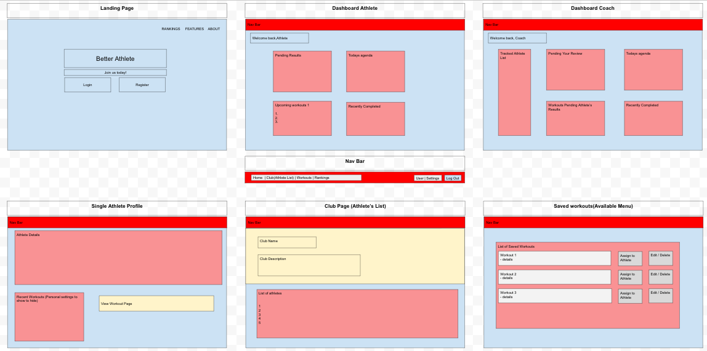
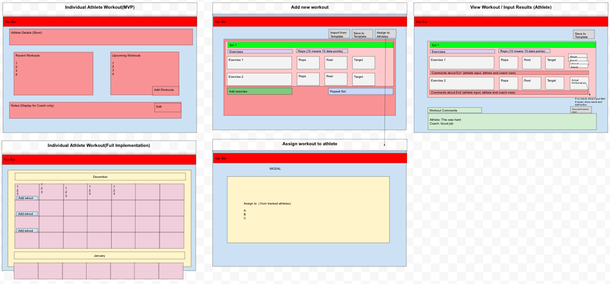

### Landing Page
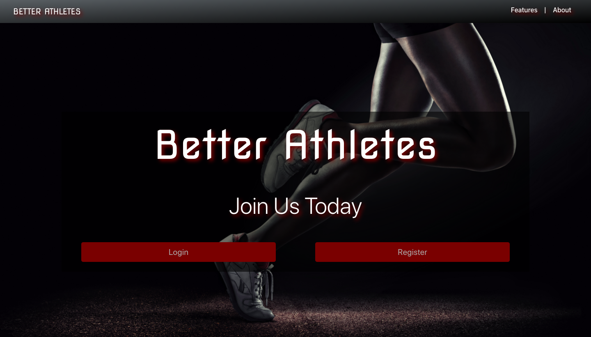
### Login Page
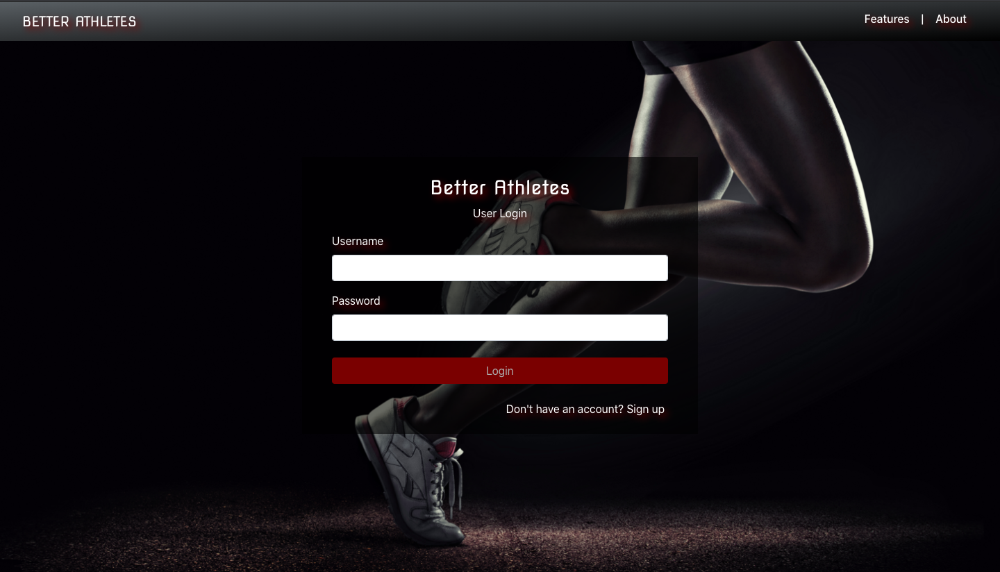
### Dashboard
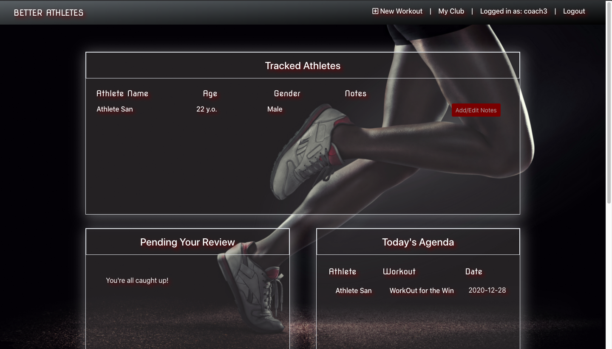
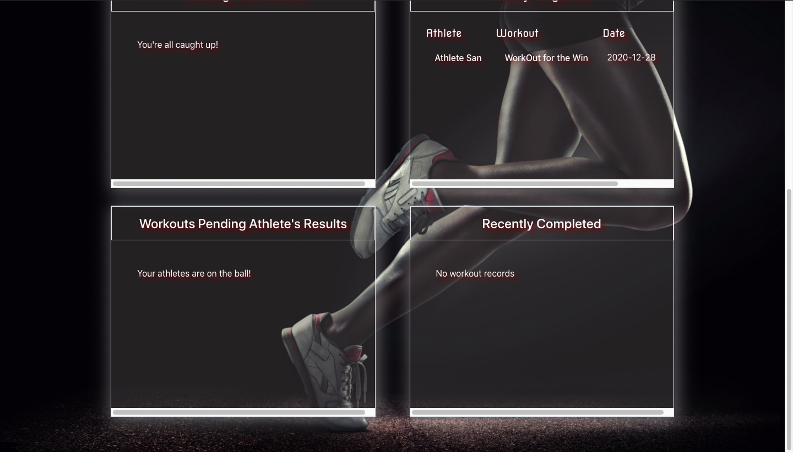
### Profile
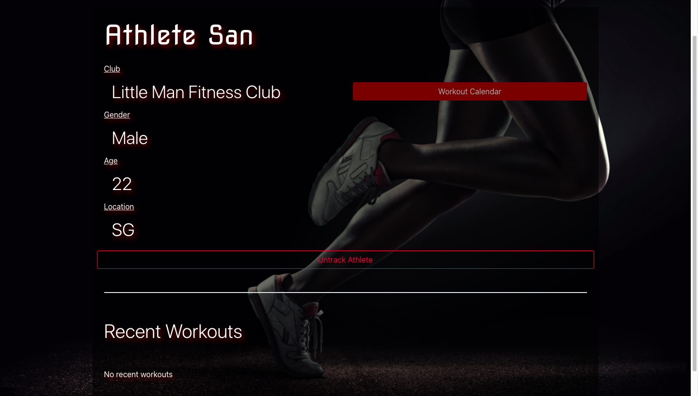
### Club Details
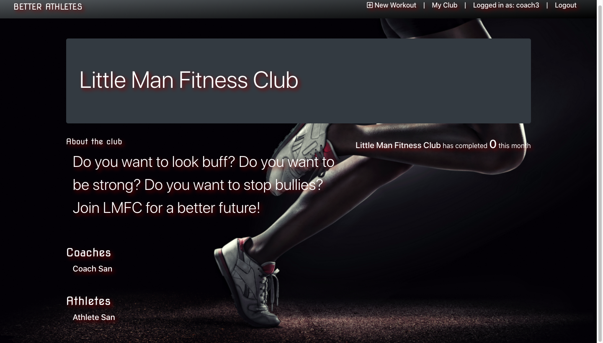
### Add Workout
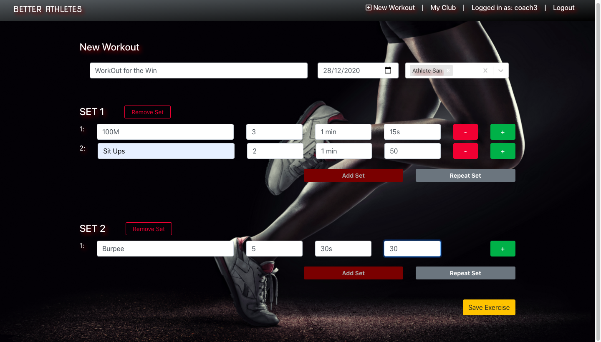
### Workout Results
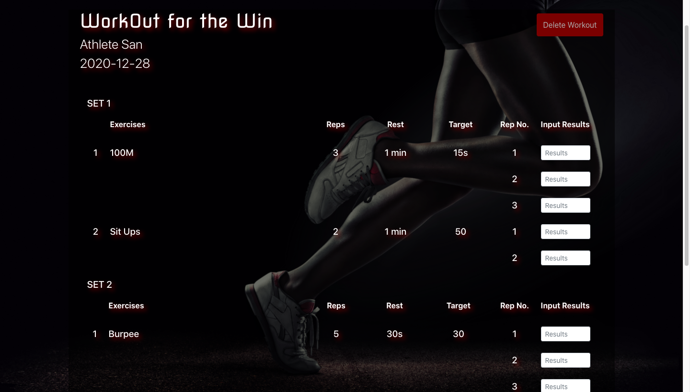
### Training Calendar
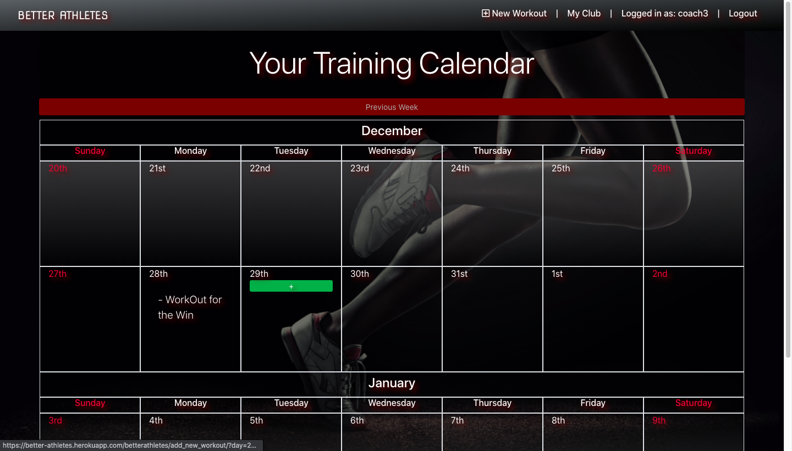

## Acknowledgements
Thank you Tyrone and Shawn for all the hardwork together to achieve and complete this app. Thanks to our instructor, Ebere Iweala and also both TAs Tristan Calleja and Lai Siu Sing for all the guidance during this project.
